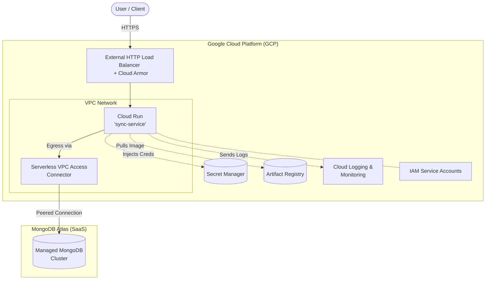

# CloudEagle DevOps Assignment - Deployment & Infrastructure Design

This repository contains the CI/CD pipeline design and infrastructure architecture for the `sync-service` Spring Boot application.

## Part 1: CI/CD Design

### 1. Branching Strategy
We follow a GitFlow-based strategy where branches map directly to our environments:
*   **`feature/*` Branches:** Used for active development. Pull Requests are opened against the `develop` branch.
*   **`develop` Branch (QA Environment):** Every merge into `develop` automatically builds and deploys the service to the **QA** environment.
*   **`staging` Branch (Staging Environment):** Code that passes QA is merged into `staging`. This triggers an auto-deploy to the **Staging** environment for user acceptance testing (UAT).
*   **`main` Branch (Production Environment):** Holds the production-ready code.

**Avoiding Accidental Production Deployments:**
1.  **Branch Protection:** Direct commits to `main` are strictly disabled. All changes must come through a Pull Request that has been reviewed and approved.
2.  **Manual Approval Gates:** Merging into `main` builds the Docker image, but the actual deployment to Production in Jenkins is paused by an `input` step, requiring a designated authorized user to manually click "Approve" before production is modified.

### 2. Jenkins Pipeline
Our `Jenkinsfile` defines a multi-stage, robust deployment process.

**High-Level Stages:**
1.  **Checkout:** Pulls the latest code from GitHub.
2.  **Build & Unit Test:** Compiles the Spring Boot app and runs unit tests using Maven.
3.  **Static Code Analysis:** Scans code for bugs and vulnerabilities (e.g., using SonarQube).
4.  **Docker Build & Push:** Packages the `.jar` into a Docker image and pushes it to Google Artifact Registry (GAR) tagged with the build number.
5.  **Deploy:** Executes deployment to QA, Staging, or Prod based on the branch.

**PR vs Merge Behavior:**
*   **On Pull Request:** When a PR is created (e.g., `feature` -> `develop`), the pipeline runs **only** the Checkout, Build, Test, and Analysis stages. It verifies the code is sound but *skips* the Deployment stage.
*   **On Merge:** Once the PR is merged into a tracked branch (`develop`, `staging`, `main`), the pipeline runs all stages *including* the deployment stage mapped to that specific environment.

**Rollback Strategy:**
If a deployment step fails (e.g., health checks fail after an update), the `post { failure { ... } }` block catches the error. The script automatically executes a `gcloud run deploy` command utilizing the *previously known stable Docker image tag*, immediately restoring the service to its prior working state without human intervention.

### 3. Configuration Management
*   **Environment-Specific Configs:** Handled natively via Spring Boot Profiles. We maintain `application-qa.yaml`, `application-staging.yaml`, and `application-prod.yaml` in the repository containing non-sensitive environment variables (like logging levels or timeout settings). 
*   **Secrets Handling:** Sensitive data (MongoDB credentials, API keys) are **never** stored in the repository. They are stored securely in **GCP Secret Manager**. During deployment, Cloud Run securely mounts these secrets and injects them into the Spring Boot application as Environment Variables at runtime.

### 4. Deployment Strategy
*   **Strategy Chosen:** **Rolling Update**
*   **Justification:** While Blue/Green is excellent for instant cutovers, it requires provisioning 2x the infrastructure during the deployment, which violates our startup cost-constraints. A **Rolling Update** gradually replaces old instances with new ones. This provides a zero-downtime deployment by redirecting traffic only to instances that pass their readiness probes, all while maintaining a steady, cost-effective resource footprint.

---

## Part 2: Infrastructure Design (GCP)

### Architecture Diagram



### Key Infrastructure Choices

**1. Compute Choice: Cloud Run**
*   *Why:* The scenario states we have startup constraints (cost) and need auto-scaling. While GKE is powerful, it has a high operational overhead and base cluster costs. Compute Engine (VMs) requires manual patching, scaling groups, and OS maintenance. **Cloud Run** is fully serverless. We only pay per 100ms of execution when the service is actively processing requests. It auto-scales from zero to thousands of instances instantly and handles load-balancing out of the box, making it the perfect low-maintenance, low-cost solution for a Spring Boot backend.

**2. Database: MongoDB Atlas**
*   *Why:* Self-hosting MongoDB on VMs requires dedicated database administrators for backups, replication, and scaling. Using Managed MongoDB Atlas (which can be peered to our GCP VPC) offloads all database maintenance. We can utilize their shared or low-tier dedicated clusters initially to fit the startup budget, scaling up with a single click as traffic grows.

**3. Networking basics**
*   **Ingress:** Public access to the service is restricted to an External Global HTTPS Load Balancer. This allows us to attach Google **Cloud Armor** to protect against DDoS attacks and SQL injection before traffic even reaches our compute layer.
*   **Egress (VPC):** Cloud Run by default operates outside a standard VPC. We use a **Serverless VPC Access connector** to route egress traffic from Cloud Run into our custom VPC. From there, it connects securely to MongoDB Atlas via VPC Peering or Private Service Connect, ensuring database traffic never traverses the public internet.

**4. Secrets & IAM**
*   **IAM:** The `sync-service` operates using a dedicated Service Account with the Principle of Least Privilege. It only has permissions to write to Cloud Logging and read specific secrets from Secret Manager. It cannot modify infrastructure.

**5. Logging & monitoring stack**
*   *Stack:* Google Cloud Operations Suite (formerly Stackdriver).
*   *Implementation:* Cloud Run natively integrates with Cloud Logging, capturing all standard out/err logs from the Spring Boot container automatically. We will configure Cloud Monitoring to track standard metrics (CPU, Memory, Request Latency) and set up alerting policies (e.g., slack notification if 5xx errors spike above 1%).

---

## Bonus: Running the Application Locally

While the assignment is primarily an architecture design test, the repository includes a fully functional dummy Spring Boot application with a multi-stage Dockerfile. To test the build locally:

### Using Docker
1. Build the Docker image:
   ```bash
   docker build -t sync-service .
   ```
2. Run the container:
   ```bash
   docker run -d -p 8080:8080 -e MONGO_URI="your-mongodb-connection-string" --name sync-service-app sync-service
   ```
3. Check the application health by navigating your browser to `http://localhost:8080/` or `http://localhost:8080/actuator/health`.
